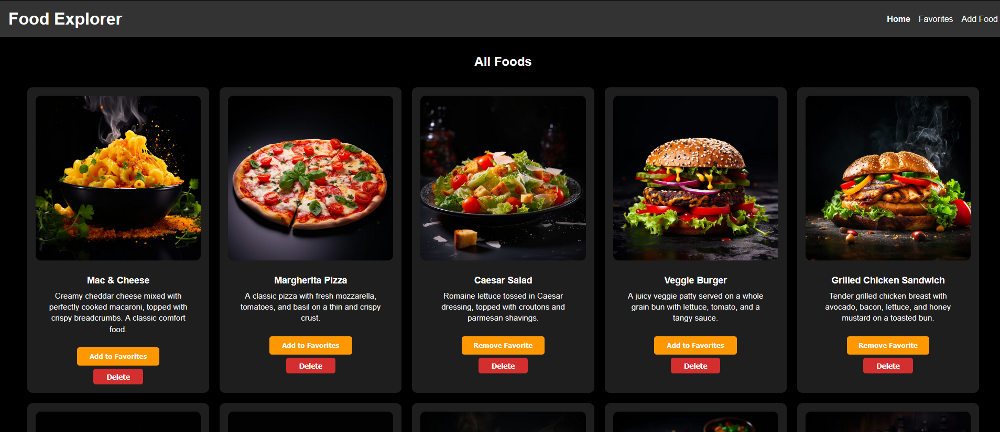

# React Food Explorer Page

## 🖼️ Preview

### Home Page  


### Favorites Page  


### Add Food Page  


## 🛠️ How to Run Locally
📦 Backend
```bash
cd react-recipe-explorer
cd backend
npm install
node app.js
```
💻 Frontend (in a separate terminal)
```bash
cd react-recipe-explorer
npm install
npm run dev
